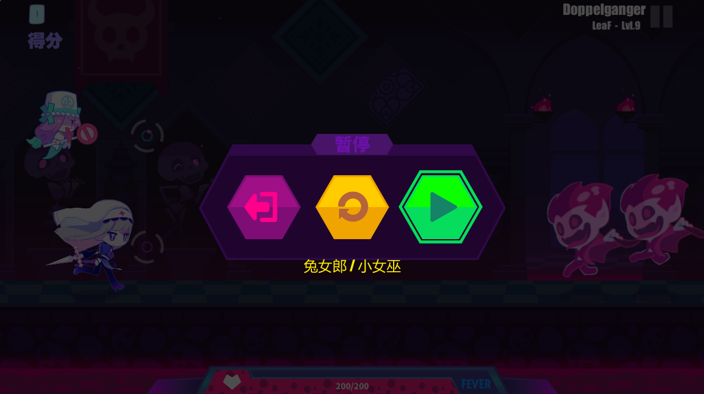
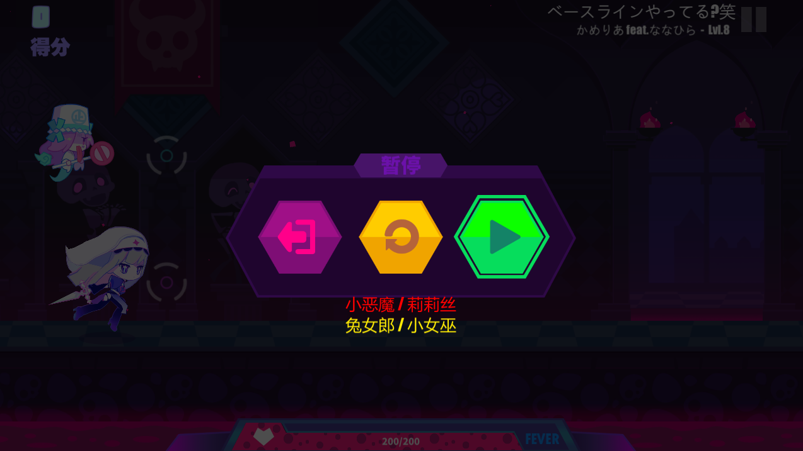

# BestCombinationSuggest

this is a melon mod for MuseDash, display the max score combination(with AllPerfect & AutoFever) on gameplay pause ui.

## Why not show on preparation ui?
mod cannot load chart data outside gameplay :(

## It display two combinations name with red and yellow in some charts

if devil & lilith is the best combination but it couldn't survive in normal All Perfect play, mod will simulate catching note with early perfect(-45ms), if devil can survive, mod will display it with red color and the 2nd best combination below it.

should be noted that the simulation result is NOT 100% correct, for reference only.

